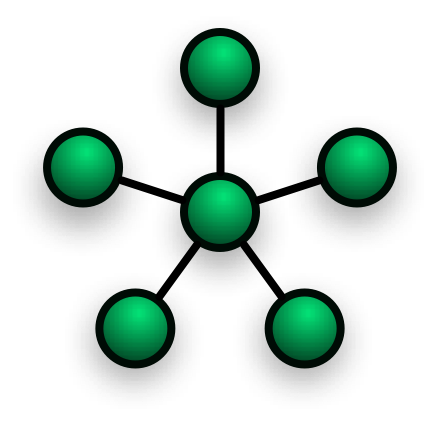

# Networking

####What is a network
A network is 2 or more computers connected to each other.  The purpose of this connection varies, but can include: uses each other's resources (printer, scanner, etc.), to game with each other, etc.

####Types of networks

We can categorize networks into two different categories based on their geographical region: __LAN__ and __WAN__.  A LAN (or local area network) is typically found within a single building, i.e. your home, a school, etc.  Whereas a WAN (or wide area network) is considered a network connection that connects LANs to each other, or to connect via a larger geographical distance, i.e across the world, or school to school.

####Topologies
What is a network topology? It is the arrangement of the elements of a network.

We'll be going over 4 different types of network topologies: __Linear__, __Ring__, __Star__, and __Tree__.

One other item to note about topological diagrams, is the term __node__.  A node for our purposes is any end-point within the network.  End-point examples can include: computers, printers, scanners, etc.

#####Linear Topology
In a linear topology, there is a single line that connects all the computers together as shown by the horizontal line below.

#####Ring Topology
In a ring topology all the computers connect to each other in a ring pattern.

#####Star Topology
In a star topology, there is a single hub point (the centre point) that connects all the computers together as shown by the star pattern below.

#####Tree Topology
In a tree topology, there is a single line that acts as a backbone to the system.  Branches come off the main backbone to connect different starred networks together.

####Sources
The first 3 topology images (linear/bus, ring, and star) were found on the [Wikipedia page for network topologies](https://en.wikipedia.org/wiki/Network_topology). _Retrieved Sept 21st, 2015_

The final image for the tree topology was found on  [this site](http://northern.lkdsb.net/Kedwell/ICS2O/Unit_Hardware/Network%20Topologies.htm). _Retrieved Sept 21st, 2015_